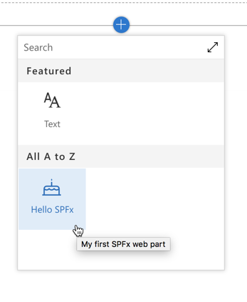
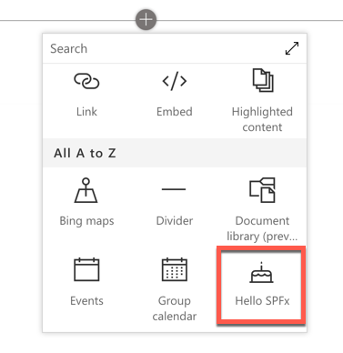
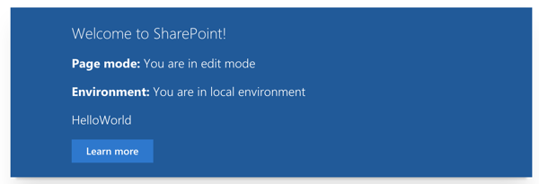
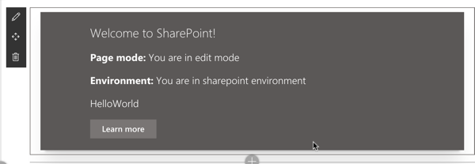
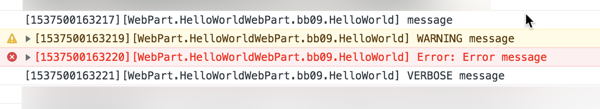
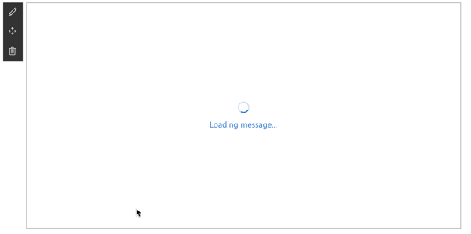

# Developing with the SharePoint Framework: Web Parts

In this lab you work with the SharePoint Framework to create a client-side web part and leverage different parts of the SharePoint Framework API.

## In this lab

- [Creating a SharePoint Framework Client-Side Web Part](#exercise1)
- [Testing with the local and hosted SharePoint Workbench](#exercise2)
- [Exploring the SharePoint Framework API](#exercise3)

## Prerequisites

To complete this lab, you need the following:

- Office 365 tenancy
  > If you do not have one, you obtain one (for free) by signing up to the [Office 365 Developer Program](https://developer.microsoft.com/office/dev-program).
- Local SharePoint Framework development environment installed and configured
  - Refer to the SharePoint Framework documentation, specifically the **[Getting Started > Set up development environment](https://docs.microsoft.com/sharepoint/dev/spfx/set-up-your-development-environment)** for the most current steps

<a name="exercise1"></a>

## Exercise 1: Creating a SharePoint Framework Client-Side Web Part

In this exercise you will create a SharePoint Framework client-side web part.

> NOTE: The instructions below assume you are using v1.8.2 of the SharePoint Framework Yeoman generator. 

1. Open a command prompt and change to the folder where you want to create the project.
1. Run the SharePoint Yeoman generator by executing the following command:

    ```shell
    yo @microsoft/sharepoint
    ```

    Use the following to complete the prompt that is displayed:

    - **What is your solution name?**: HelloWorld
    - **Which baseline packages do you want to target for your component(s)?**: SharePoint Online only (latest)
    - **Where do you want to place the files?**: Use the current folder
    - **Do you want to allow the tenant admin the choice of being able to deploy the solution to all sites immediately without running any feature deployment or adding apps in sites?**: No
    - **Will the components in the solution require permissions to access web APIs that are unique and not shared with other components in the tenant?** No
    - **Which type of client-side component to create?**: WebPart
    - **What is your Web part name?**: HelloWorld
    - **What is your Web part description?**: HelloWorld description
    - **Which framework would you like to use?**: No JavaScript framework

    After provisioning the folders required for the project, the generator will install all the dependency packages using NPM.

1. When NPM completes downloading all dependencies, run the project by executing the following command:

    ```shell
    gulp serve
    ```

1. The SharePoint Framework's gulp **serve** task will build the project, start a local web server and launch a browser open to the SharePoint Workbench:

    

1. Select the web part icon button to open the list of available web parts:

    

1. Select the **HelloWorld** web part:

    

1. Edit the web part's properties by selecting the pencil (edit) icon in the toolbar to the left of the web part:

    

1. In the property pane that opens, change the value of the **Description Field**. Notice how the web part updates as you make changes to the text:

    1

### Update the web part code

1. Next, update the code in the `render()` method to add a button that responds to an event.
    1. If the local dev webserver is not running, start it by running `gulp serve` on the command line from the root folder of the project.
    1. Open the project folder in **Visual Studio Code**.
    1. Locate and open the file **src/webparts/helloWorld/HelloWorldWebPart.ts**.
    1. Within this file, locate the `render()` method. Locate the following line:

        ```html
        <a href="https://aka.ms/spfx" class="${ styles.button }">
        ```

        ...and replace replace the URL with a simple hash symbol:

        ```html
        <a href="#" class="${ styles.button }">
        ```

    1. Next, add the following code to the end of the `render()` method. 

        This will wire up some code to the **click** event on the anchor tag and display an alert on the page.

        ```typescript
        this.domElement.getElementsByClassName(`${ styles.button }`)[0]
          .addEventListener('click', (event: any) => {
            event.preventDefault();
            alert('Welcome to the SharePoint Framework!');
          });
        ```

1. Go back to the browser to test your changes. The browser should have refreshed the changes you made.
1. Click the **Learn More** button.

    Notice the button triggers a JavaScript alert displaying the message you added in the above code.

1. Close the browser and stop the local web server by pressing <kbd>CTRL</kbd>+<kbd>C</kbd> in the command prompt.

### Update the web part's properties

Now make some changes to the web part's properties to give it a new name, description and icon.

1. The web part's metadata is found in it's manifest file.

    Locate and open the file **src/webparts/helloWorld/HelloWorldWebPart.manifest.json**.

1. In the section **preconfiguredEntries**, locate the following lines:

    ```json
    "preconfiguredEntries": [{
      ...
      "title": { "default": "HelloWorld" },
      "description": { "default": "HelloWorld description" },
      "officeFabricIconFontName": "Page",
      ...
    }]
    ```

1. Change the web part's title and description to something different.
1. The web part's icon is the name of one of the icons listed in the Office UI Fabric, located here: [https://developer.microsoft.com/fabric#/styles/icons](https://developer.microsoft.com/fabric#/styles/icons). Pick one and update the `officeFabricIconFontName` property:

    ```json
    "preconfiguredEntries": [{
      ...
      "title": { "default": "Hello SPFx" },
      "description": { "default": "My first SPFx web part" },
      "officeFabricIconFontName": "BirthdayCake",
      ...
    }]
    ```

1. Start the local web server using the provided gulp **serve** task:

    ```shell
    gulp serve
    ```

1. The SharePoint Framework's gulp **serve** task will build the project, start a local web server and launch a browser open to the SharePoint Workbench. This time when you hover the mouse over the web part in the toolbox, you will see the changes you applied to your web part:

    

1. Close the browser and stop the local web server by pressing <kbd>CTRL</kbd>+<kbd>C</kbd> in the command prompt.

<a name="exercise2"></a>

## Exercise 2: Testing with the local and hosted SharePoint Workbench

In this exercise you will work with the two different versions of the SharePoint Workbench, the local & hosted workbench, as well as the different modes of the built in gulp **serve** task.

1. Open **Visual Studio Code** and open the SharePoint Framework web part project you created in the previous exercise.
1. Start the local web server using the provided gulp **serve** task:

    ```shell
    gulp serve
    ```

1. The SharePoint Framework's gulp **serve** task will build the project, start a local web server and launch a browser open to the SharePoint Workbench.
1. Add the web part to the page.
1. Now, with both the browser and Visual Studio code on the same screen, edit the HTML in the web part's `render()` method, located in the **src/webparts/helloWorld/HelloWorldWebPart.ts** file.
1. If you save the file (*or let Visual Studio Code save it after a few seconds of inactivity*), you will see the command prompt window execute a lot of commands and then the browser will refresh.

    This is because the gulp **serve** task is monitoring all code files such as `*.ts`, `*.html` and `*.scss` for changes. If they change, it reruns the tasks that `gulp serve` ran for you. It then refreshed the browser as it is using a utility that allows the server to have some control over the local workbench.

    This makes development very easy!

### Testing with the SharePoint Online Hosted Workbench

1. Next, in the browser navigate to one of your SharePoint Online sites and append the following to the end of the root site's URL: **/_layouts/workbench.aspx**. This is the SharePoint Online hosted workbench.
1. Notice when you add a web part, many more web parts will appear beyond the one we created and was the only one showing in the toolbox on the local workbench. This is because you are now testing the web part in a working SharePoint site.

    

    > NOTE: The difference between the local and hosted workbench is significant. Consider a local workbench is not a working version of SharePoint, rather just a single page that can let you test web parts. This means you won't have access to a real SharePoint context, lists, libraries or real users when you are testing in the local workbench.

1. Let's see another difference with the local vs. hosted workbench. Go back to the web part and make a change to the HTML. 

    Notice after saving the file, while the console displays a lot of commands, the browser that is displaying the hosted workbench does not automatically reload. This is expected. You can still refresh the page to see the updated web part, but the local web server cannot cause the hosted workbench to refresh.

1. Close both the local and hosted workbench and stop the local web server by pressing <kbd>CTRL</kbd>+<kbd>C</kbd> in the command prompt.

### The different modes of the gulp serve task

The gulp **serve** task that you have run so far has automatically opened the local workbench. But there may be cases where you do not want to launch the local workbench and rather, you want to test with the hosted workbench. In these scenarios, you have two options.

1. Start the local web server using the provided gulp **serve** task:

    ```shell
    gulp serve --nobrowser
    ```

1. In this case the gulp **serve** task will run just like normal and start the local webserver, but it will not launch the browser.
1. Open a browser and navigate to one of your SharePoint Online sites and append the following to the end of the root site's URL: **/_layouts/workbench.aspx**.
1. Notice the web part is appearing in the toolbox. Everything still works, you just don't get the default browser!
1. Close the hosted workbench and stop the local web server by pressing <kbd>CTRL</kbd>+<kbd>C</kbd> in the command prompt.

But what if you want the browser to open the hosted workbench automatically for you? In that case, you can use a configuration setting to tell the gulp **serve** task what to do.

1. Locate and open the file **config/serve.json**
1. In the **serve.json** file, add the following JSON to the end of the JSON file:

    ```json
    "serveConfigurations": {
      "default": {
        "pageUrl": "https://contoso.sharepoint.com/sites/mySite/_layouts/workbench.aspx"
      },
      "myConfig": {
        "pageUrl": "https://contoso.sharepoint.com/sites/mySite/_layouts/workbench.aspx"
      }
    }
    ```

    The resulting file would look like the following:

    ```json
    {
      "$schema": "https://developer.microsoft.com/json-schemas/core-build/serve.schema.json",
      "port": 4321,
      "https": true,
      "initialPage": "https://localhost:5432/workbench",
      "api": {
        "port": 5432,
        "entryPath": "node_modules/@microsoft/sp-webpart-workbench/lib/api/"
      },
      "serveConfigurations": {
        "default": {
          "pageUrl": "https://contoso.sharepoint.com/sites/mySite/_layouts/workbench.aspx"
        },
        "myConfig": {
          "pageUrl": "https://contoso.sharepoint.com/sites/mySite/_layouts/workbench.aspx"
        }
      }
    }
    ```

    > NOTE: Ensure you enter the proper URL of a SharePoint Online site collection you have access to.

1. Now, run either of the following two commands to start the local web server and navigate to the hosted workbench:

    ```shell
    gulp serve
    # or
    gulp serve --config myConfig
    ```

1. Notice the browser will now load, but it will also navigate to you to your hosted workbench in SharePoint Online.

    You can use multiple configurations for different sites if you like. This will be useful when you test SharePoint Framework extensions.

1. Close the hosted workbench and stop the local web server by pressing <kbd>CTRL</kbd>+<kbd>C</kbd> in the command prompt.

<a name="exercise3"></a>

## Exercise 3: Exploring the SharePoint Framework API

In this exercise you will explore a few different APIs available to you in the SharePoint Framework that are useful in many scenarios.

1. Open the web part project from the first exercise.
1. Remove the gulp **serve** configurations you created in the previous exercise:
    1. Locate and open the **config/serve.json** file.
    1. Locate the section `serveConfigurations` and remove it.
    1. Save you changes and close the file.

### Checking the current page mode and state

1. Locate the web part file **src/webparts/helloWorld/HelloWorldWebPart.ts**.
1. At the top of the file, locate the following line:

    ```ts
    import { Version } from '@microsoft/sp-core-library';
    ```

1. Update this line to the following to import a few additional objects and enumerations into the file:

    ```ts
    import { 
      Version,
      DisplayMode, 
      Environment, 
      EnvironmentType
    } from '@microsoft/sp-core-library';
    ```

1. Now locate the `render()` method and add the following two lines to the top of it, right after the method declaration:

    ```ts
    const pageMode : string = (this.displayMode === DisplayMode.Edit)
      ? 'You are in edit mode'
      : 'You are in read mode';
    const environmentType : string = (Environment.type === EnvironmentType.Local)
      ? 'You are in local environment'
      : 'You are in SharePoint environment';
    ```

    These two lines determine the current mode of the page and environment the web part is running in. These can prove to be useful for the web part to render either mock data in the case of running in the local web server or real SharePoint data from a SharePoint list if you are running the web part in a SharePoint environment such as the hosted workbench or in a real SharePoint page.

1. Display the values in these two members by adding the following two lines to the HTML that is added to the `<div>` element that contains the rendered web part. Add these lines just after the **Welcome to SharePoint** message:

    ```html
    <p class="${ styles.subTitle }"><strong>Page mode:</strong> ${ pageMode }</p>
    <p class="${ styles.subTitle }"><strong>Environment:</strong> ${ environmentType }</p>
    ```

1. Let's test the web part to see what we get. Start the local web server using the provided gulp **serve** task:

    ```shell
    gulp serve
    ```

1. When the browser loads the local workbench, add the web part to the page. Notice the values of the page mode & environment type:

    

1. Now, open a new browser tab and navigate to one of your SharePoint Online sites and append the following to the end of the root site's URL: **/_layouts/workbench.aspx**.
1. Add the web part to the page.
1. Notice the values of the page mode & environment type:

    

### Leverage the SharePoint Framework Logging API

The SharePoint Framework also provides a way log messages to the console with additional information than the traditional `console.log()` method provides.

1. Locate the web part file **src/webparts/helloWorld/HelloWorldWebPart.ts**.
1. At the top of the web part file, locate the following lines:

    ```ts
    import { 
      Version,
      DisplayMode, 
      Environment, 
      EnvironmentType
    } from '@microsoft/sp-core-library';
    ```

1. Add an additional reference to `Log` the existing list so it looks like this:

    ```ts
    import { 
      Version,
      DisplayMode, 
      Environment, 
      EnvironmentType, 
      Log 
    } from '@microsoft/sp-core-library';
    ```

1. Add the following lines to the end of the `render()` method, immediately before it closes. These will look different messages to the browser's console window:

    ```ts
    Log.info('HelloWorld', 'message', this.context.serviceScope);
    Log.warn('HelloWorld', 'WARNING message', this.context.serviceScope);
    Log.error('HelloWorld', new Error('Error message'), this.context.serviceScope);
    Log.verbose('HelloWorld', 'VERBOSE message', this.context.serviceScope);
    ```

1. Go back to the browser tab containing the local workbench and open your browser's developer tools.
1. Open the **Console** tab (*it may have a slightly different name depending on the browser you are using*).
1. There will be a lot of messages logged to the console, so use the filter technique to filter based on the name of your web part, **HelloWorld**.
1. Notice in the following image that each message is prefixed with the unique name of the web part.

    

### Addressing delayed loading web parts

At times your web part may have a number of calculations to perform or have a delay in fetching data before it renders the first time. Thankfully the SharePoint Framework provides an API you can use to address this.

1. Locate the web part file **src/webparts/helloWorld/HelloWorldWebPart.ts**.
1. Locate the following line in the `render()` method:

    ```ts
    this.domElement.innerHTML = `
    ```

1. Add the following lines just before the `this.domElement.innerHTML` line:

    ```ts
    this.context.statusRenderer.displayLoadingIndicator(this.domElement, "message");
    setTimeout(() => {
      this.context.statusRenderer.clearLoadingIndicator(this.domElement);
    ```

1. Add the following line just after the code that attaches the event handler to the button:

    ```ts
    }, 5000);
    ```

1. The code you just added displays the string **message** in a loading indicator for 5 seconds before clearing it out and writing HTML to the page.

    The resulting code should look similar to this:

    ```ts
    public render(): void {

      const pageMode : string = this.displayMode === DisplayMode.Edit ? 'You are in edit mode' : 'You are in read mode';
      const environmentType : string = Environment.type === EnvironmentType.Local ? 'You are in local environment' : 'You are in sharepoint environment';

      this.context.statusRenderer.displayLoadingIndicator(this.domElement, "message");
      setTimeout(() => {
        this.context.statusRenderer.clearLoadingIndicator(this.domElement);

        this.domElement.innerHTML = `
          <div class="${ styles.helloWorld }">
            <div class="${ styles.container }">
              <div class="${ styles.row }">
                <div class="${ styles.column }">
                  <span class="${ styles.title }">Welcome to SharePoint!</span>
                  <p class="${ styles.subTitle }"><strong>Page mode:</strong> ${ pageMode }</p>
                  <p class="${ styles.subTitle }"><strong>Environment:</strong> ${ environmentType }</p>
                  <p class="${ styles.description }">${escape(this.properties.description)}</p>
                  <a href="#" class="${ styles.button }">
                    <span class="${ styles.label }">Learn more</span>
                  </a>
                </div>
              </div>
            </div>
          </div>`;

        this.domElement.getElementsByClassName(`${styles.button}`)[0]
          .addEventListener('click', (event: any) => {
            event.preventDefault();
            alert('Welcome to the SharePoint Framework!');
          });
      }, 5000);

      Log.info('HelloWorld', 'message', this.context.serviceScope);
      Log.warn('HelloWorld', 'WARNING message', this.context.serviceScope);
      Log.error('HelloWorld', new Error('Error message'), this.context.serviceScope);
      Log.verbose('HelloWorld', 'VERBOSE message', this.context.serviceScope);
    }
    ```

1. Go back to the browser and if it hasn't reloaded, refresh the page.
1. When the web part initially loads, it displays the loading message:

    

1. After five (5) seconds, notice the web part is rendered as it was before because the timeout concludes.
1. Close the browser and stop the local web server by pressing <kbd>CTRL</kbd>+<kbd>C</kbd> in the command prompt.